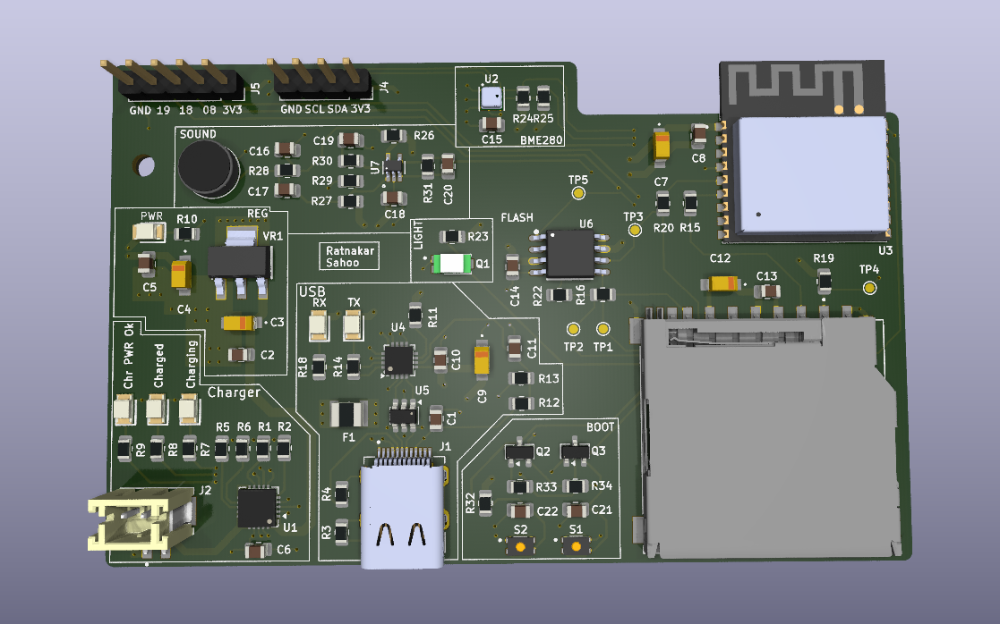
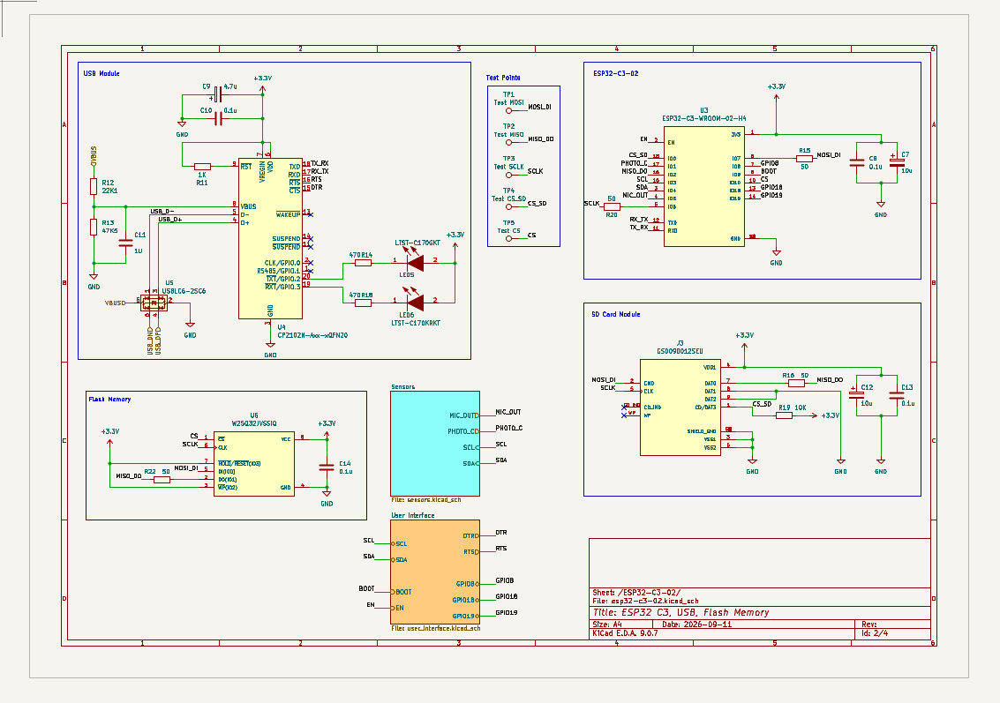
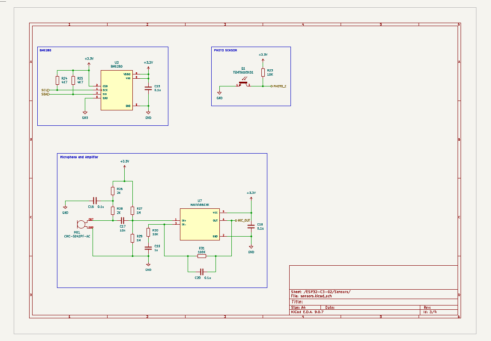
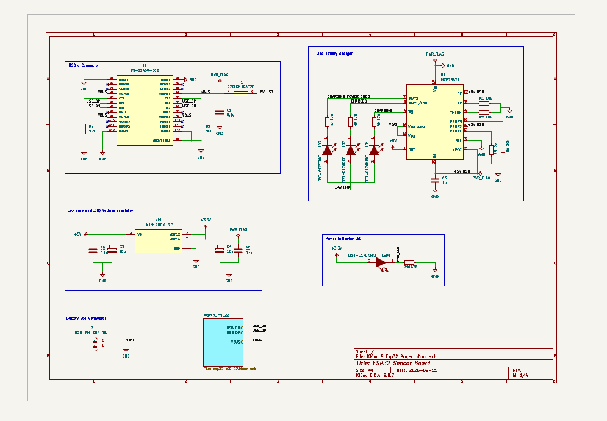
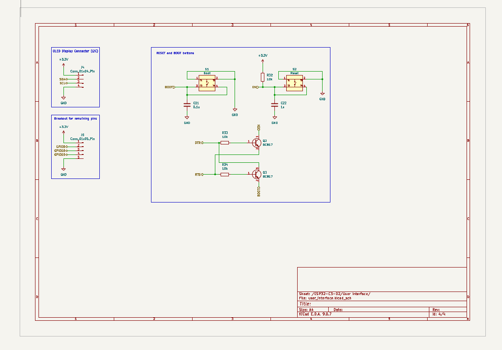
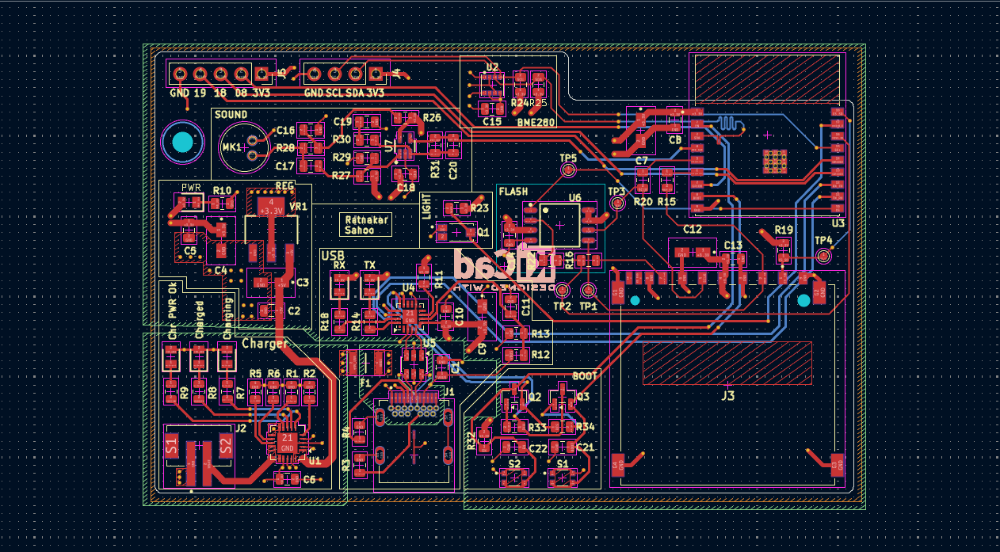

# ESP32-Sensor-Board

> A custom ESP32-C3 based sensor and embedded systems development board designed in KiCad 9.

  

  <b>Custom ESP32-C3 Sensor & Embedded Systems Development Board</b>

---

## 📌 Overview

The **ESP32-Sensor-Board** is a custom embedded systems development board built around the **ESP32-C3** microcontroller.

The board integrates environmental sensing, sound sensing, USB connectivity, battery charging, power regulation, user-interface controls, and external expansion interfaces into a single compact PCB.

The complete hardware design was developed in **KiCad 9**, including schematic capture, hierarchical design, PCB layout, 3D visualization, custom libraries, DFM analysis, and manufacturing outputs.

---

## ✨ Key Features

- 🧠 ESP32-C3 based processing
- 🌡️ BME280 environmental sensor
- 🔊 On-board sound sensing
- 🔌 USB connectivity
- 🔋 Li-ion/Li-Po battery charging
- ⚡ On-board voltage regulation
- 💡 Power and charging indicators
- 🔘 Boot and reset buttons
- 📡 I2C interface
- 🚀 SPI interface
- 🔗 GPIO expansion
- 🧪 Dedicated test points
- 📦 Custom KiCad symbol and footprint libraries
- 🏭 Manufacturing-ready Gerber and drill files
- 📐 Hierarchical schematic design

---

# 🧩 Hardware Overview

| Component / Feature | Description |
|---|---|
| Microcontroller | ESP32-C3 |
| Environmental Sensor | BME280 |
| Sound Sensing | On-board sound sensing circuit |
| USB | USB connectivity |
| Power Input | USB / Rechargeable Battery |
| Battery Charging | Li-ion/Li-Po charging circuit |
| Regulation | On-board voltage regulation |
| Communication | I2C / SPI |
| Expansion | GPIO headers |
| Debugging | Test points |
| PCB Design | KiCad 9 |

---

# 📐 Schematic

The design follows a **hierarchical schematic structure**, separating the major functional blocks into dedicated schematic sheets.

## Complete Schematic

  

---

# 🌡️ Sensor Section

The sensor subsystem includes the **BME280 environmental sensor**.

### BME280

The BME280 provides digital measurements of:

- Temperature
- Relative Humidity
- Atmospheric Pressure

The sensor communicates with the ESP32-C3 through a digital interface.

### 🔊 Sound Sensing

An on-board sound sensing circuit is also included for detecting variations in ambient sound.

Potential applications include:

- Environmental monitoring
- Sound/activity detection
- IoT sensing
- Event-triggered applications

  

---

# ⚡ Power Management

The power subsystem manages the board's power input, battery charging, voltage regulation, and status indication.

The design includes:

- USB power input
- Rechargeable battery support
- Battery charging
- Voltage regulation
- Power-status indication
- Charging-status indication

  

---

# 🎛️ User Interface

The board provides several controls and indicators for development, debugging, and normal operation.

### User Interface Features

- Boot button
- Reset button
- Power indicator
- Charging indicators
- USB RX/TX indicators
- Status indicators

  

---

# 🖥️ PCB Design

The PCB was designed using **KiCad 9** with emphasis on:

- Compact component placement
- Organized routing
- Functional block separation
- Practical power distribution
- Accessible debugging points
- Clear silkscreen labeling
- External expansion
- Manufacturability

## PCB Layout

  

## 3D PCB View

  

---

# 🔌 Interfaces

## USB

USB connectivity is provided for:

- Power
- Programming
- Serial communication

## I2C

The I2C interface allows additional sensors and peripherals to be connected to the board.

## SPI

SPI connectivity is available for peripherals requiring higher-speed communication, such as displays, memory devices, and other external modules.

## GPIO

Additional GPIO pins are exposed through board headers for connecting external sensors, modules, and other peripherals.

---

# 🧪 Debugging & Test Points

Dedicated test points are provided across the board to make hardware bring-up, debugging, and signal verification easier.

These can be used with a:

- Multimeter
- Oscilloscope
- Logic analyzer
- Other debugging equipment

---

# 🏭 Manufacturing

Manufacturing files are provided in the:

**`ESP32_Gerbers/`**

directory.

The repository contains the generated **Gerber and drill files** required for PCB fabrication.

DFM-related manufacturing files are also included under:

**`dfm/gerber/`**

---

# 📁 Repository Structure

    ESP32-Sensor-Board/
    │
    ├── ESP32_Gerbers/
    │   └── Gerber & drill files
    │
    ├── Libraries/
    │   └── Custom KiCad symbols & footprints
    │
    ├── dfm/
    │   └── gerber/
    │       └── DFM / manufacturing files
    │
    ├── images/
    │   ├── ESP32-Schematic.png
    │   ├── PCB-3d-front.png
    │   ├── PCB-layout.png
    │   ├── Power-section-Schematic.png
    │   ├── Sensor-Section.png
    │   └── User-interface.png
    │
    ├── KiCad 9 Esp32 Project.kicad_pro
    ├── KiCad 9 Esp32 Project.kicad_sch
    ├── KiCad 9 Esp32 Project.kicad_pcb
    │
    ├── esp32-c3-02.kicad_sch
    ├── sensors.kicad_sch
    ├── user_interface.kicad_sch
    │
    ├── .gitignore
    └── README.md

---

# 🛠️ Tools & Technologies

- **KiCad 9**
- **ESP32-C3**
- PCB Design
- Schematic Capture
- Hierarchical Schematics
- Embedded Systems
- Sensor Interfaces
- Power Electronics
- IoT Hardware Design
- PCB Manufacturing

---

# ✅ Project Status

| Design Stage | Status |
|---|---|
| Schematic Design | ✅ Completed |
| Hierarchical Schematic | ✅ Completed |
| Sensor Integration | ✅ Completed |
| Power Management | ✅ Completed |
| PCB Layout | ✅ Completed |
| 3D PCB Design | ✅ Completed |
| Custom Libraries | ✅ Completed |
| Gerber Generation | ✅ Completed |
| DFM Analysis | ✅ Completed |
| Hardware Fabrication | 🔄 To be updated |

---

# 📚 Design Files

The complete KiCad project files are included in this repository.

The project can be opened and further modified using **KiCad 9**.

The repository includes:

- KiCad project configuration
- Main hierarchical schematic
- Individual schematic sheets
- PCB layout
- Custom symbol libraries
- Custom footprint libraries
- Gerber files
- Drill files
- DFM outputs
- Project documentation

---

# 👤 Author

**Ratnakar Sahoo**

Embedded Systems & PCB Design

---

# 📄 License

This project is provided for educational and development purposes.

Please refer to the repository contents for the applicable design and manufacturing files.
